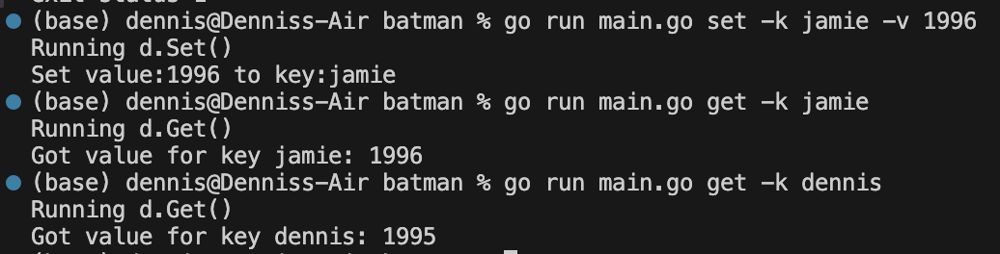

# batman
Batman is a file watcher. Batman will watch a linode bucket and look for any changes. This is achieved by using Redis. First, a ticker will trigger batman to check the Linode bucket, file by file. We put in fileName:hashValue (key:value) pairs into a Redis hashmap/database to keep track of changes. we look at each file in Linode and cross-check it with our Redis database. If it's not in our DB, we add it and signal that a change occurred. This signal is a message sent to a queue through SQS services.

Here's a breakdown of how everything is connected:

**main.go -> cmd.go -> demo.go -> s3.go + sqs.go + redis.go**

# Start Guide
Before starting, make sure you have an SQS queue, Linode bucket, and Redis DB up and running!

### 1. Accessing AWS credentials file...
Enter this into your terminal.
```
nano ~/.aws/credentials
```

### 2. Create profiles for Linode and AWS
In the text file, just create the profiles with this layout and replace corresponding keys.

```
[aws]
aws_access_key_id = YOUR_AWS_ACCESS_KEY
aws_secret_access_key = YOUR_AWS_SECRET_KEY

[linode]
aws_access_key_id = YOUR_LINODE_ACCESS_KEY
aws_secret_access_key = YOUR_LINODE_SECRET_KEY
```

### 3. Verify...
Enter this into the terminal to check everything was input correctly.

```
aws configure list --profile aws
aws configure list --profile linode
```

### 4. Accessing AWS config file
We have to also alter the config file.
```
nano ~/.aws/config
```

### 5. Create corresponding configs for the credentials
Copy and paste this in there. Make sure your region is correct!
```
[profile aws]
region = us-east-1

[profile linode]
region = us-east-1
```

### 6. Edit config.yaml
We need to update our Viper environment variables. Replace with the appropriate information.

```
redis:
  port: 6380

s3:  
  bucket: "pcw-test"  
  region: "us-east-1"
  endpoint: "https://us-east-1.linodeobjects.com"

sqs:
  url: https://sqs.us-east-1.amazonaws.com/890742596725/test-queue
```

### 7. Start!
Before starting, go to cmd.go. Notice this line that defines the flags for the command watch on line 163:
```
WatchCmd.PersistentFlags().IntVarP(&t, "time", "t", 3, "number of seconds to wait")
```
The 4th argument can be replaced with a number to set default. If you want to set it to check every minute by default, change 3 to 60.

Run the program! 
```
go run main.go watch
```

# Viper & Cobra
>Viper is a configuration management library in Go that helps manage environment variables, configuration files, and command-line flags, making it easy to handle application configuration. Cobra is a powerful library for creating command-line interfaces (CLI) in Go, allowing developers to structure and organize CLI commands and subcommands efficiently. Together, Viper and Cobra are commonly used to build flexible, well-organized CLI applications with robust configuration management.

ChatGPT

## config.yaml
This file holds our environment variables. We can set them here for abstraction and easier code reading.

## cobra & viper set up
Make sure you have the appropriate packages downloaded. Paste into terminal.
```
go get github.com/spf13/cobra
go get github.com/spf13/viper
```

# Redis
>Redis (Remote Dictionary Server) is an open-source, in-memory data store known for its speed, flexibility, and support for a variety of data structures, such as strings, hashes, lists, sets, and sorted sets. Primarily used as a cache, message broker, or database, Redis operates entirely in memory with optional persistence to disk, making it exceptionally fast for real-time applications that require low-latency access. Its pub/sub messaging capabilities and atomic operations also make Redis a strong choice for building distributed systems and handling high-throughput workloads like session management, real-time analytics, and leaderboard tracking.

That's ChatGPT. For our purposes, we are using it as a database which holds file names and their hash value. 

## Setting up Reddis...

### 1. Documentation
https://redis.io/docs/latest/develop/connect/clients/go/

### 2. Installing Redis for Go
Paste this into terminal:
```
go get github.com/redis/go-redis/v9
```
### 3. Starting Redis server
```
redis-server --port 6380
```

# first steps...


## setting.getting values in redis
```
go run main.go set -k dennis -v 1995
```


```
go run main.go get -k dennis
```




