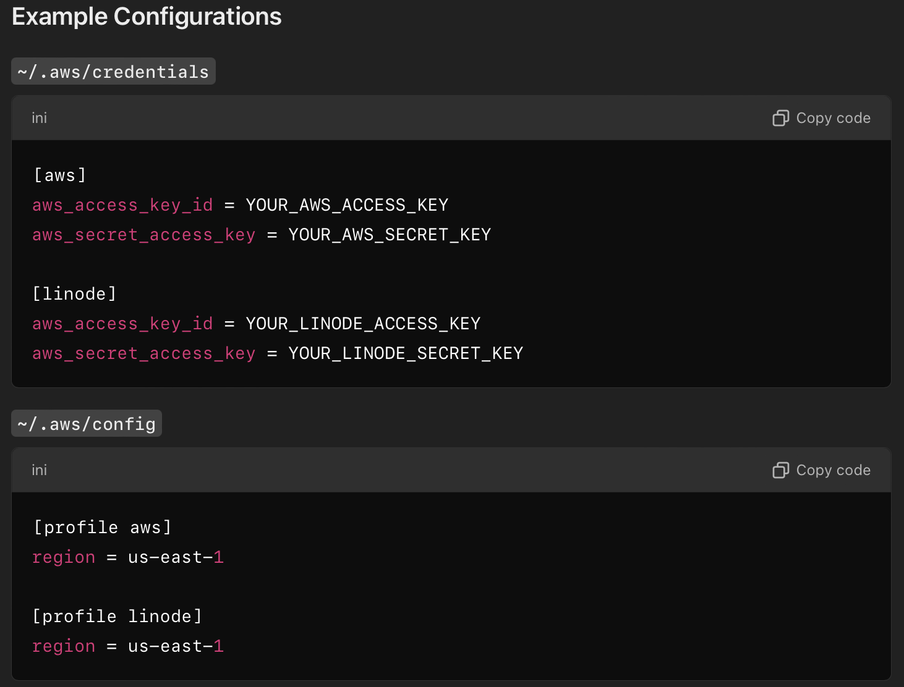

# batman
file watcher that monitors an s3 compliant bucket. checks if a file was added or modified, and adds that to a redis hash map to keep track of changes.

## first steps...
```
go mod init github.com/dennis-yeom/fw
```
## configuring multiple keys...


## installing cobra...
make sure you have downloaded necessary packages:

```
go get -u github.com/spf13/cobra
```

## testing cobra command lines...
to see possible entries:
```
go run main.go -h
```

### aws
make sure you set up your aws keys!

```
export AWS_ACCESS_KEY_ID="your-access-key-id"
export AWS_SECRET_ACCESS_KEY="your-secret-access-key"
```

### redis for go
https://redis.io/docs/latest/develop/connect/clients/go/

go get command to install reddis: `go get github.com/redis/go-redis/v9`

starting redis server: `redis-server --port 6380`

### syntax
run command `go run main.go --help`


## creating module
```
go mod init projectName
```


## cobra & viper set up
make sure you have cobra and viper set up:
```
go get github.com/spf13/cobra
go get github.com/spf13/viper
```


## setting.getting values in redis
```
go run main.go set -k dennis -v 1995
```


```
go run main.go get -k dennis
```


