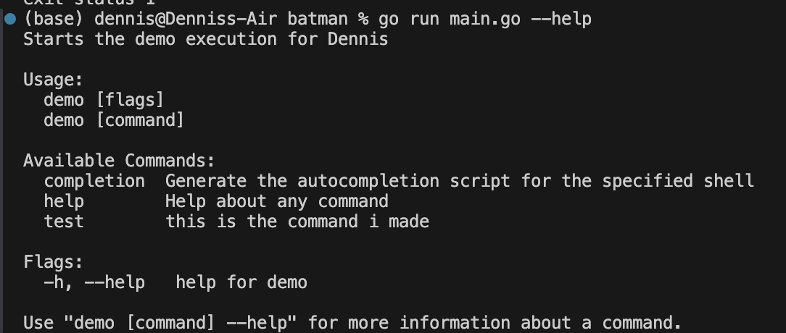
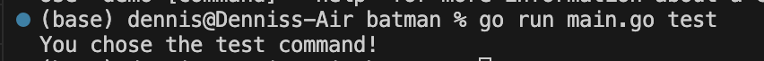

# batman
file watcher

## creating module
```
go mod init projectName
```

## cobra & viper set up
make sure you have cobra and viper set up:
```
go get github.com/spf13/cobra
go get github.com/spf13/viper
```

## running test command line
```
go run main.go --help
```



```
go run main.go test
```



## reddis client in go
https://redis.io/docs/latest/develop/connect/clients/go/

go get command to install reddis:
```
go get github.com/redis/go-redis/v9
```

