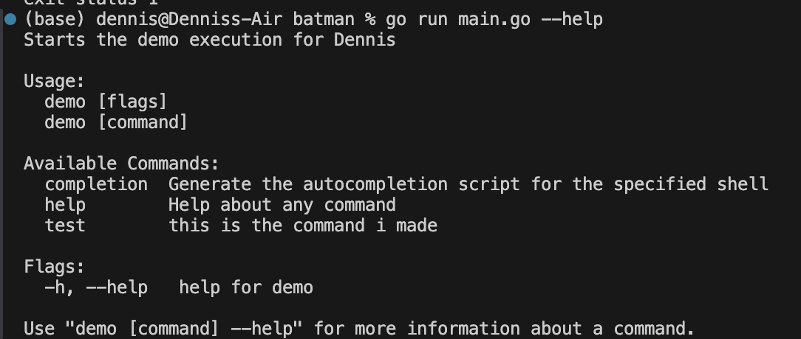
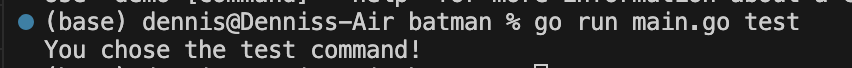

# batman
file watcher that monitors an s3 compliant bucket. checks if a file was added or modified, and adds that to a redis hash map to keep track of changes.

## creating module
```
go mod init projectName
```


## cobra & viper set up
make sure you have cobra and viper set up:
```
go get github.com/spf13/cobra
go get github.com/spf13/viper
```


## running test command line
```
go run main.go --help
```



```
go run main.go test
```



## reddis client in go
https://redis.io/docs/latest/develop/connect/clients/go/

go get command to install reddis:
```
go get github.com/redis/go-redis/v9
```


## starting redis server
```
redis-server --port 6380
```


## setting.getting values in redis
```
go run main.go set -k dennis -v 1995
```


```
go run main.go get -k dennis
```


## AWS Access:
	•	Ensure you have AWS credentials (Access Key ID and Secret Access Key) with permissions for S3, SQS, and other required services.
	•	Set up your environment variables for AWS credentials:

```
export AWS_ACCESS_KEY_ID="your-access-key-id"
export AWS_SECRET_ACCESS_KEY="your-secret-access-key"
```